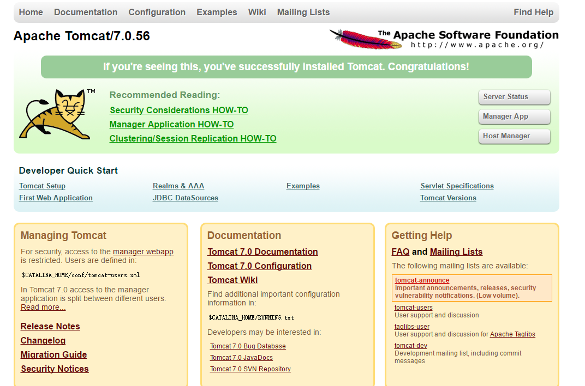

# Tomcat

安装目录 /opt/tomcat-7.0.65

## 部署
1、创建目录
```
# 创建项目目录和服务器目录
mkdir ~/project
mkdir ~/server
mkdir ~/server/logs
mkdir ~/server/temp
mkdir ~/server/bin
```

2、复制配置文件
```
# 复制tomcat的默认项目和配置文件
cp -R /opt/tomcat-7.0.65/webapps ~/project/webapps
cp -R /opt/tomcat-7.0.65/conf ~/server/conf
```

3、修改配置
```
rm -f ~/server/conf/server.xml
vi ~/server/conf/server.xml
```

配置内容
```
<?xml version='1.0' encoding='utf-8'?>
<!-- 服务器管理端口,默认8005 -->
<Server port="10005" shutdown="SHUTDOWN">
  <Listener className="org.apache.catalina.startup.VersionLoggerListener" />
  <Listener className="org.apache.catalina.core.AprLifecycleListener" SSLEngine="on" />
  <Listener className="org.apache.catalina.core.JasperListener" />
  <Listener className="org.apache.catalina.core.JreMemoryLeakPreventionListener" />
  <Listener className="org.apache.catalina.mbeans.GlobalResourcesLifecycleListener" />
  <Listener className="org.apache.catalina.core.ThreadLocalLeakPreventionListener" />
  <GlobalNamingResources>
    <Resource name="UserDatabase" auth="Container"
              type="org.apache.catalina.UserDatabase"
              description="User database that can be updated and saved"
              factory="org.apache.catalina.users.MemoryUserDatabaseFactory"
              pathname="conf/tomcat-users.xml" />
  </GlobalNamingResources>

  <Service name="Catalina">

   <!-- 应用端口,默认8080,增加编码集 -->
    <Connector port="10080" protocol="HTTP/1.1"
               connectionTimeout="20000"
               redirectPort="8443" 
         URIEncoding="UTF-8" />
  <!-- 不使用AJP -->
    <!-- Define an AJP 1.3 Connector on port 8009 -->
    <!-- <Connector port="8009" protocol="AJP/1.3" redirectPort="8443" /> -->

    <Engine name="Catalina" defaultHost="localhost">

      <Realm className="org.apache.catalina.realm.LockOutRealm">
     
        <Realm className="org.apache.catalina.realm.UserDatabaseRealm"
               resourceName="UserDatabase"/>
      </Realm>
    
    <!-- 主机信息,name主机名,appBase代码路径(可以使用绝对路径和相对路径[相对于$CATALINA_BASE]) -->
      <Host name="localhost"  appBase="../project/webapps"
            unpackWARs="true" autoDeploy="true">


        <Valve className="org.apache.catalina.valves.AccessLogValve" directory="logs"
               prefix="localhost_access_log." suffix=".txt"
               pattern="%h %l %u %t &quot;%r&quot; %s %b" />

      </Host>
    </Engine>
  </Service>
</Server>
```

4、编写脚本

启动脚本 `vi ~/server/bin/start.sh`

```
#!/bin/sh

curr_path=$(cd "$(dirname "$0")"; pwd)
echo $curr_path

export CATALINA_BASE=$curr_path/..


/opt/tomcat-7.0.65/bin/startup.sh
```

停止脚本 `vi ~/server/bin/stop.sh`

```
#!/bin/sh

curr_path=$(cd "$(dirname "$0")"; pwd)
echo $curr_path

ps -ef|grep tomcat|grep java|grep $curr_path|grep -v grep|awk '{print $2}'|xargs kill -9
```
 
## 测试
1、启动 `sh ~/server/bin/start.sh` <br>
2、浏览器访问http:ip:10080,出现如下提示表示启动成功 <br>


