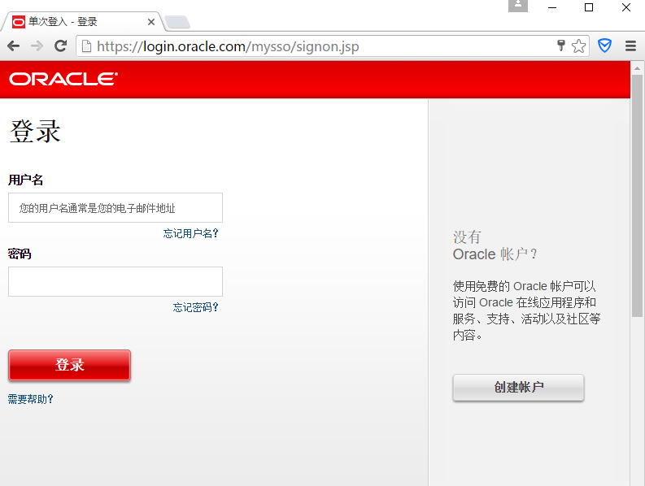
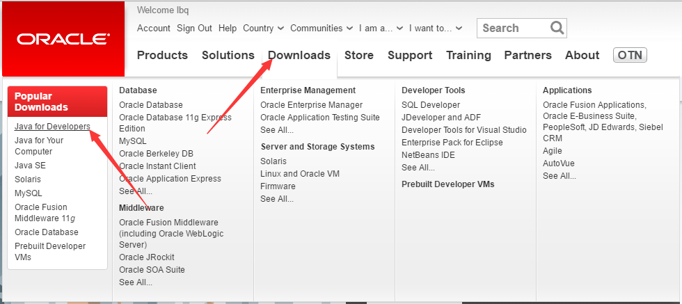
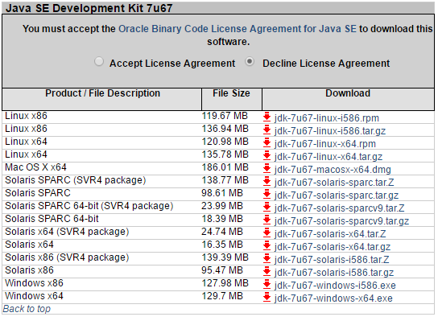
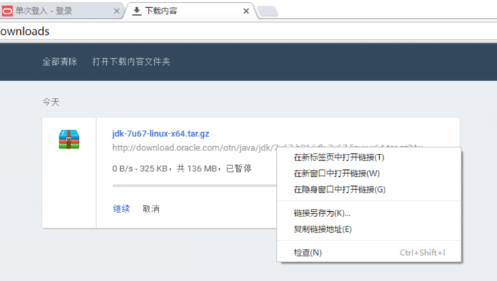
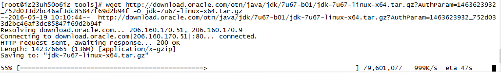

# 安装JDK

安装目录 /opt/jdk1.7.0_67

## 下载
1、使用浏览器打开`ORACLE`[官方网站](http://www.oracle.com/index.html) <br>
2、登录 <br>
 <br>
 <br>
 <br>
3、选择`Downloads`下的`Java for Developers` <br>
 <br>
 <br>
4、选择底部的`Java Archive` <br>
 <br>
 <br>
5、根据需要选择对应的版本(例子使用的是jdk1.7.0_67)  <br>
  <br>
  <br>
 <br>
6、打开浏览器的下载页面,复制下载地址(不需要本地下载,只获取下载地址) <br>
 <br>
 <br>
7、在服务器端使用`wget 复制的下载地址 -O jdk-7u67-linux-x64.tar.gz`下载 <br>
 <br>
 <br>

## 安装
解压缩`JDK`到`/opt/jdk1.7.0_67` <br>
`tar -xvf jdk-7u67-linux-x64.tar.gz` <br>
`mv jdk1.7.0_67 /opt/jdk1.7.0_67`

## [配置](./profile.md)
1、`vi /etc/profile` <br>
2、在文件末尾添加
```
# jdk
export JAVA_HOME=/opt/jdk1.7.0_67
export PATH=$PATH:$JAVA_HOME/bin
```
3、`source /etc/profile`

## 测试
`java -version` 显示如下内容表示配置成功

    java version "1.7.0_67"
    Java(TM) SE Runtime Environment (build 1.7.0_67-b01)
    Java HotSpot(TM) 64-Bit Server VM (build 24.65-b04, mixed mode)
