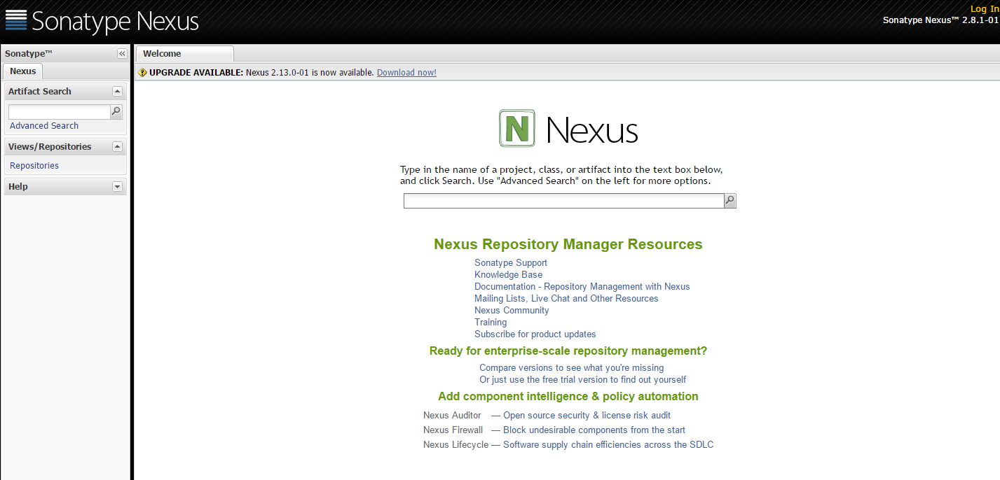

# Nexus

安装目录 /opt/nexus-2.8.1-01

## 下载
`wget https://download.sonatype.com/nexus/oss/nexus-2.8.1-01-bundle.tar.gz`

更多[下载地址](https://support.sonatype.com/hc/en-us/articles/218238798)

## 安装
```
tar -xvf nexus-2.8.1-01-bundle.tar.gz
mv nexus-2.8.1-01 /opt/nexus-2.8.1-01
mv sonatype-work /opt/sonatype-work
```

## 配置环境变量
1、编辑 `vi /etc/profile` 在文件最后增加 <br>
```
# nexus
export NEXUS_HOME=/opt/nexus-2.8.1-01
export PATH=$PATH:$NEXUS_HOME/bin
```
2、生效 `source /etc/profile`

## 设置java
```
vi /opt/nexus-2.8.1-01/bin/jsw/conf/wrapper.conf
```
修改`wrapper.java.command`为java的绝对路径
```
# java使用绝对路径
# wrapper.java.command=java
wrapper.java.command=/opt/jdk1.7.0_67/bin/java
```

## 测试
nexus 依赖[jdk](jdk.md),请确定已经安装 <br>
1、启动 `export RUN_AS_USER=root && nexus start` <br>
2、登录控制台 <br>
浏览器访问 http://ip:8081/nexus <br>


## 开机启动
1、编辑 `vi /etc/rc.d/init.d/nexus`

```
#!/bin/sh
#
# nexus:    Nexus
#
# chkconfig:    - 90 25 
# description:  Nexus
#
# Source function library.
. /etc/rc.d/init.d/functions
. /etc/sysconfig/network
 
# 定义启动
start() 
{
        echo -n $"Starting nexus: "
        export RUN_AS_USER=root
        /opt/nexus-2.8.1-01/bin/nexus start
        echo
}

# 定义停止
stop() 
{
        echo -n $"Shutting down nexus: "
        killproc nexus 
        echo
}

# 如果文件不存在,退出
[ -f /opt/nexus-2.8.1-01/bin/nexus ] || exit 0
 
# 根据参数判断.
case "$1" in
  start)
        start
        ;;
  stop)
        stop
        ;;
  restart|reload)
        stop
        start
        ;;
  *)
        echo $"Usage: $0 {start|stop|restart|reload}"
        exit 1
esac
exit 0
```

2、赋权 `chmod +x /etc/rc.d/init.d/nexus`

3、添加到系统启动
```
chkconfig  --add nexus
chkconfig  --level 235  nexus  on
chkconfig  --list | grep nexus
```

