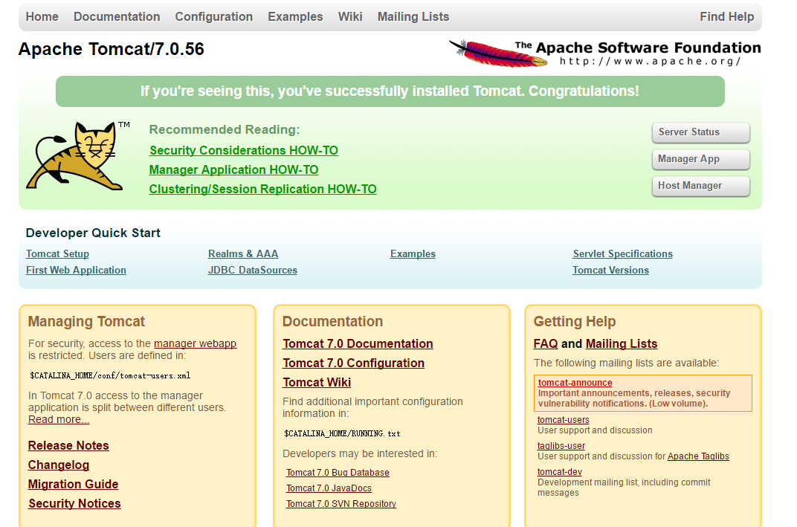

# Tomcat

安装目录 /opt/tomcat-7.0.65

## 下载
`wget http://archive.apache.org/dist/tomcat/tomcat-7/v7.0.65/bin/apache-tomcat-7.0.65.tar.gz`

更多[下载地址](http://archive.apache.org/dist/tomcat/tomcat-7/)

## 安装
```
tar -xvf apache-tomcat-7.0.65.tar.gz
mv apache-tomcat-7.0.65 /opt/tomcat-7.0.65
```

## 配置环境变量
1、编辑 `vi /etc/profile` 在文件最后增加 <br>
```
# tomcat
export CATALINA_HOME=/opt/tomcat-7.0.65
```
2、生效 `source /etc/profile`

## 测试
tomcat 依赖[jdk](jdk.md),请确定已经安装 <br>
1、启动 `/opt/tomcat-7.0.65/bin/startup.sh`  <br>
2、登录控制台 <br>
浏览器访问 http://ip:8080 <br>


